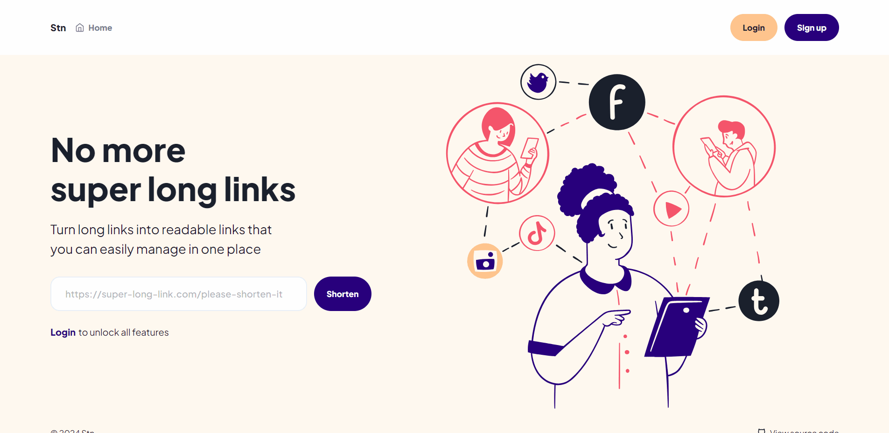
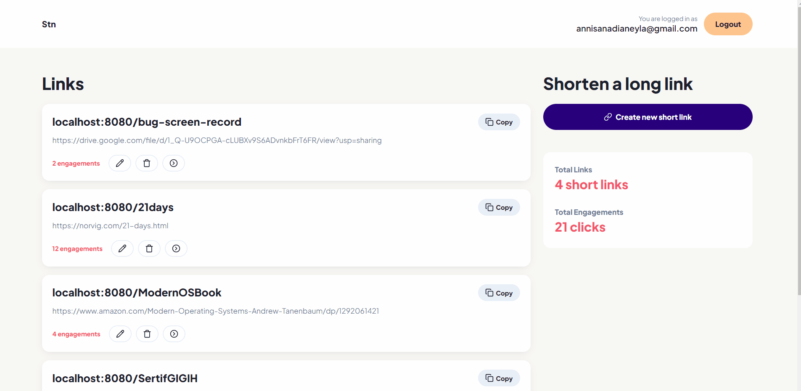
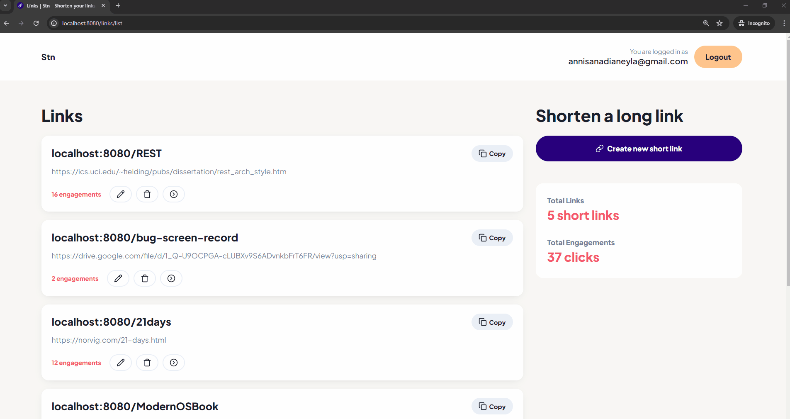
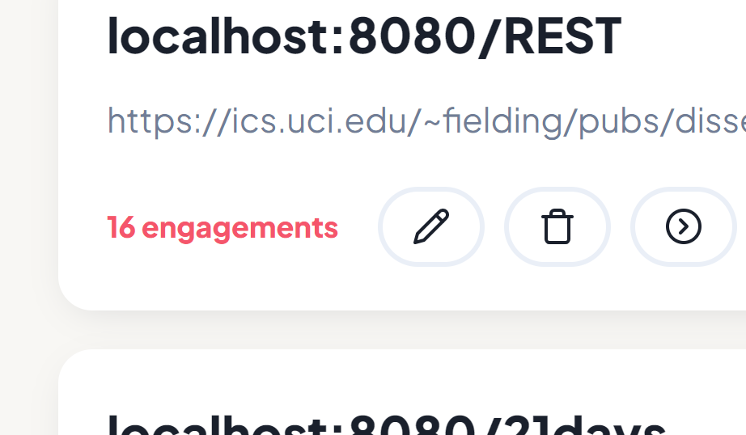
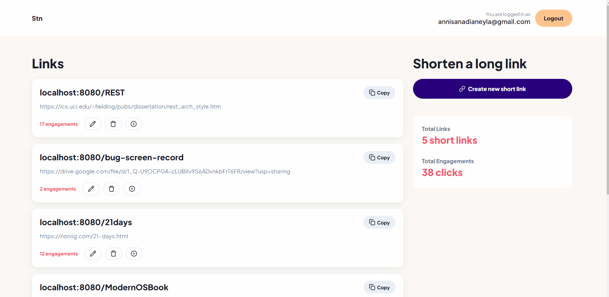
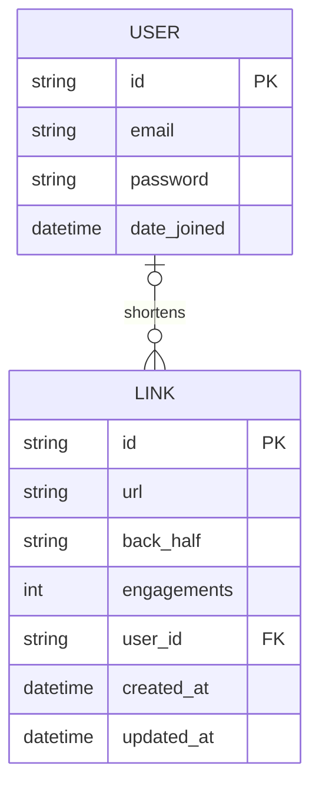

<div align="center">
  <a href="#"></a>
  <br><br>
  <h1>Stn</h1>
  <p>Shorten your links, share it easily</p>
  <br>
</div>

## Table of Contents

- [Description](#description)
- [Live Demo](#live-demo)
- [Main Features](#main-features)
- [Routes](#routes)
- [Database Schema](#database-schema)
- [Tech Stack](#tech-stack)
- [Run Locally](#run-locally)
- [Contributing](#contributing)
- [License](#license)

## Description

[`^ back to top ^`](#table-of-contents)

**Stn** is a web-based app for shortening long links & managing them in one place. It is written in [Go](https://go.dev) with minimal dependencies. In addition to making link sharing easier, I also created this to learn more about web server & its interactions with client & database.

## Live Demo

[`^ back to top ^`](#table-of-contents)

Check out the web app here:

## Main Features

[`^ back to top ^`](#table-of-contents)

### Shorten a Long Link





### Redirect the Short Link



### View Engagements



### Manage Links



## Routes

[`^ back to top ^`](#table-of-contents)

| **Method** | **Pattern**     | **Description**                       |
| ---------- | --------------- | ------------------------------------- |
| GET        | /users/signup   | Show the sign up page.                |
| POST       | /users/signup   | Register a user.                      |
| GET        | /users/login    | Show the login page.                  |
| POST       | /users/login    | Authenticate a user.                  |
| POST       | /users/logout   | Log out a user from the app.          |
| GET        | /               | Show the home page.                   |
| GET        | /:backhalf      | Redirect to the original link.        |
| GET        | /links/list     | Show links created by a user.         |
| GET        | /links/create   | Show the page to shorten a long link. |
| POST       | /links/create   | Shorten a long link.                  |
| GET        | /links/:id      | Show the details of a link.           |
| GET        | /links/:id/edit | Show the page to edit a link.         |
| PUT        | /links/:id/edit | Edit a link.                          |
| DELETE     | /links/:id      | Delete a link.                        |

## Database Schema

[`^ back to top ^`](#table-of-contents)



## Tech Stack

[`^ back to top ^`](#table-of-contents)

- Language: [Go 1.22](https://go.dev)
- DBMS: [MySQL](https://www.mysql.com)
- Database Migration: [migrate](https://github.com/golang-migrate/migrate)
- Session Management: [SCS](https://github.com/alexedwards/scs)
- UI: [HTML](https://developer.mozilla.org/en-US/docs/Web/HTML), [CSS](https://developer.mozilla.org/en-US/docs/Web/CSS), [JavaScript](https://developer.mozilla.org/en-US/docs/Web/JavaScript)

## Run Locally

[`^ back to top ^`](#table-of-contents)

### Development

- Make sure you have [Go 1.22](https://go.dev), [MySQL](https://www.mysql.com), [migrate](https://github.com/golang-migrate/migrate), & [Make](https://www.gnu.org/software/make) installed on your computer. Run these commands to check whether the tools are already installed. The terminal will output the version number if it is installed.

  ```bash
  go version
  ```

  ```bash
  mysql --version
  ```

  ```bash
  migrate -version
  ```

  ```bash
  make --version
  ```

- Connect to the MySQL server by providing a user name & password.

  ```bash
  mysql -u root -p
  ```

  Then create a database. You can name it as `stn`.

  ```sql
  CREATE DATABASE stn CHARACTER SET utf8mb4 COLLATE utf8mb4_unicode_ci;
  ```

- Clone the repo.

  ```bash
  git clone https://github.com/nadiannis/stn.git
  ```

  ```bash
  cd stn
  ```

- Make a copy of `.env.example` file & rename it to `.env`.

  ```bash
  cp .env.example .env
  ```

  Connect the app to the database by writing the information about the database you use in the `.env` file.

  ```bash
  # example

  DB_USER=stn
  DB_PASS=password
  DB_PROTO=tcp
  DB_HOST=localhost
  DB_PORT=3306
  DB_NAME=stn
  ```

- Install the dependencies.

  ```bash
  go mod tidy
  ```

- Apply migrations.

  ```bash
  make db/migrations/up
  ```

- Run the server. The web server will run on port 8080.

  ```bash
  make run/web
  ```

### Format & Check the Code

Run this command to tidy the dependencies, format the code, & vet the code.

```bash
make audit
```

## Contributing

[`^ back to top ^`](#table-of-contents)

You can contribute to this project by creating an [issue](https://github.com/nadiannis/stn/issues) or [pull request](https://github.com/nadiannis/stn/pulls).

## License

[`^ back to top ^`](#table-of-contents)

This project is licensed under the MIT License - see the [LICENSE](https://github.com/nadiannis/stn/blob/main/LICENSE) file for details.
